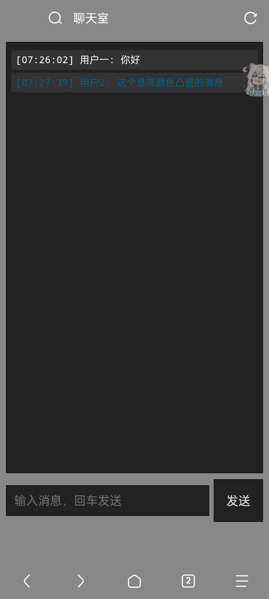

# litewebchat


一个用AI和golang写的网页聊天就一个文件没啥花里胡哨的

#DEMO

怎么跑

```bash
go run main.go
```
不想装Go环境的，去这里下载编译好的：
**[点我下载发行版](https://github.com/niko12344-ls/litewebchat/releases/latest)**
然后浏览器打开 localhost:8080

用了啥

· go 标准库 (net/http)

· gorilla/websocket (就这一个外部依赖)

目录结构

```
.
├── main.go      # 全部后端逻辑
└── go.mod
```
配置端口（可选）

默认端口是 8080，如果被占用或者想换端口，在程序同目录下创建 chat_config.json 文件：

```json
{
  "port": 3000
}
```
有啥功能

· 进入网页后 只需要输入用户名就可以聊天

· 如果想突出的话 可以输入颜色的hex

· 还有一个就是小巧

就这么简单，没啥复杂的。

为啥写这个

方便在学校机房里快速聊天使用(毕竟不能说话和传纸条)

想改的话 随便改即可 也不需要留什么声明和署名
